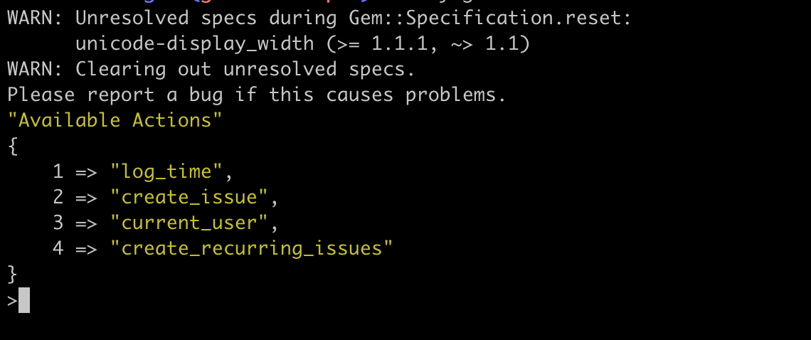

# gitlab-cli
Create and manage gitlab issues using CLI

Just need to add configuration in CONFIG.

To run: 

`gem install gitlab`

`ruby gitlab.rb`

You will see something like this on your terminal. Choose an option and proceed.
